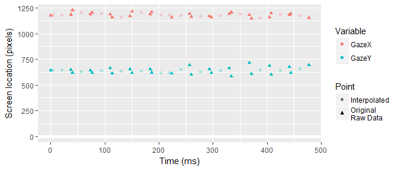

<!-- README.md is generated from README.Rmd. Please edit that file -->
fillgaze
========

The goal of fillgaze is to provide helper functions for interpolating missing eyetracking data.

Installation
------------

You can install fillgaze from github with:

``` r
# install.packages("devtools")
devtools::install_github("tjmahr/fillgaze")
```

Package overview
----------------

This package was created in response to a very strange file of eyetracking data.

``` r
df <- readr::read_csv("inst/test-gaze.csv")
```

Here is the problem with this file:

``` r
library(dplyr, warn.conflicts = FALSE)
#> Warning: package 'dplyr' was built under R version 3.4.1
library(ggplot2)

ggplot(head(df, 40)) + 
  aes(x = Time - min(Time)) + 
  geom_hline(yintercept = 0, size = 2, color = "white") + 
  geom_point(aes(y = GazeX, color = "GazeX")) +
  geom_point(aes(y = GazeY, color = "GazeY")) + 
  labs(x = "Time (ms)", y = "Screen location (pixels)", 
       color = "Variable")
```


Every second or third point is incorrectly placed offscreen, indicated by a negative pixel values for the gaze locations. It is physiologically impossible for a person's gaze to oscillate so quickly and with such magnitude (the gaze is tracked on a large screen display).

We would like to interpolate spans of missing data using neighboring points. That's the point of this package. The steps to solve the problem involve:

-   \[x\] Converting offscreen values into proper `NA` values.
-   \[x\] Identifying and describing gaps of missing values (streaks of successive `NA`s).
-   \[x\] Interpolating the values in a gap.
-   \[x\] Writing tests to confirm that everything works as expected. :innocent:

### Setting values in several columns to `NA`

We need to mark offscreen points as properly missing data. `set_values_to_na()` takes a dataframe and named filtering predicates. Here's the basic usage.

``` r
set_values_to_na(dataframe, {col_name} = {function to determine NA values})
```

The values that return `TRUE` for each function are replaced with `NA` values. For example, `set_values_to_na(df, var1 = ~ .x < 0)` would:

-   look for the column `var1` in the dataframe,
-   check which values of `.x < 0` are true where `.x` is a placeholder/pronoun for the values in `df$var1`,
-   and replace those values where the test is `TRUE` with `NA`.

``` r
library(fillgaze)
original_df <- df

df <- df %>% 
  set_values_to_na(
    GazeX = ~ .x < -100, 
    GazeY = ~ .x < -100, 
    LEyeCoordX = ~ .x < -.1, 
    LEyeCoordY = ~ .x < -.1,
    REyeCoordX = ~ .x < -.1, 
    REyeCoordY = ~ .x < -.1)

# Before and after on some of the GazeX values
data_frame(before = head(original_df$GazeX), after = head(df$GazeX))
#> # A tibble: 6 x 2
#>      before    after
#>       <dbl>    <dbl>
#> 1  1176.452 1176.452
#> 2 -1920.000       NA
#> 3 -1920.000       NA
#> 4  1184.452 1184.452
#> 5  1224.841 1224.841
#> 6 -1920.000       NA
```

Now, those offscreen points will not be plotted because they are `NA`.

``` r
last_plot() %+% head(df, 40)
#> Warning: Removed 15 rows containing missing values (geom_point).

#> Warning: Removed 15 rows containing missing values (geom_point).
```


### Finding gaps in the data

We can use `find_gaze_gaps()` to locate the gaps in a column of data. This function mostly is used internally. Users are not expectedly to routinely use this function, but I cover it here because the function for filling gaps relies on the data in this dataframe.

``` r
find_gaze_gaps(df, GazeX) %>% 
  print(width = 120)
#> # A tibble: 579 x 14
#>     .var .time_var start_row end_row na_rows start_value end_value change_value time_start time_first_na time_end
#>    <chr>     <chr>     <dbl>   <dbl>   <dbl>       <dbl>     <dbl>        <dbl>      <int>         <int>    <int>
#>  1 GazeX    .rowid         1       4       2    1176.452  1184.452        8.000          1             2        4
#>  2 GazeX    .rowid         5       7       1    1224.841  1187.916      -36.925          5             6        7
#>  3 GazeX    .rowid         8      10       1    1203.642  1188.502      -15.140          8             9       10
#>  4 GazeX    .rowid        11      13       1    1158.650  1171.602       12.952         11            12       13
#>  5 GazeX    .rowid        14      16       1    1218.452  1188.027      -30.425         14            15       16
#>  6 GazeX    .rowid        17      20       2    1208.003  1156.564      -51.439         17            18       20
#>  7 GazeX    .rowid        20      22       1    1156.564  1191.023       34.459         20            21       22
#>  8 GazeX    .rowid        23      25       1    1164.210  1171.983        7.773         23            24       25
#>  9 GazeX    .rowid        26      28       1    1158.890  1194.300       35.410         26            27       28
#> 10 GazeX    .rowid        29      31       1    1207.380  1179.723      -27.657         29            30       31
#> # ... with 569 more rows, and 3 more variables: na_duration <int>,
#> #   change_time <int>, sd_change <dbl>
```

Each row describes a gap in the column.

-   `start_row` and `end_row` contain row numbers of nearest non-`NA` values.
-   `na_rows` is the number of successive `NA`s in the gap.
-   `start_value`and `end_value` contain the nearest non-`NA` values.
-   `change_value` is the difference between `start_value` and `end_value`.

The function also measure the duration of the gap (`change_time`). By default, it uses row numbers (`.rowid`) to measure duration. We can use an explicit column to use as the measure of time.

``` r
find_gaze_gaps(df, GazeX, time_var = Time) %>% 
  print(width = 120)
#> # A tibble: 579 x 14
#>     .var .time_var start_row end_row na_rows start_value end_value change_value   time_start time_first_na     time_end
#>    <chr>     <chr>     <dbl>   <dbl>   <dbl>       <dbl>     <dbl>        <dbl>        <dbl>         <dbl>        <dbl>
#>  1 GazeX      Time         1       4       2    1176.452  1184.452        8.000 1.493309e+12  1.493309e+12 1.493309e+12
#>  2 GazeX      Time         5       7       1    1224.841  1187.916      -36.925 1.493309e+12  1.493309e+12 1.493309e+12
#>  3 GazeX      Time         8      10       1    1203.642  1188.502      -15.140 1.493309e+12  1.493309e+12 1.493309e+12
#>  4 GazeX      Time        11      13       1    1158.650  1171.602       12.952 1.493309e+12  1.493309e+12 1.493309e+12
#>  5 GazeX      Time        14      16       1    1218.452  1188.027      -30.425 1.493309e+12  1.493309e+12 1.493309e+12
#>  6 GazeX      Time        17      20       2    1208.003  1156.564      -51.439 1.493309e+12  1.493309e+12 1.493309e+12
#>  7 GazeX      Time        20      22       1    1156.564  1191.023       34.459 1.493309e+12  1.493309e+12 1.493309e+12
#>  8 GazeX      Time        23      25       1    1164.210  1171.983        7.773 1.493309e+12  1.493309e+12 1.493309e+12
#>  9 GazeX      Time        26      28       1    1158.890  1194.300       35.410 1.493309e+12  1.493309e+12 1.493309e+12
#> 10 GazeX      Time        29      31       1    1207.380  1179.723      -27.657 1.493309e+12  1.493309e+12 1.493309e+12
#> # ... with 569 more rows, and 3 more variables: na_duration <dbl>,
#> #   change_time <dbl>, sd_change <dbl>
```

The function also respects dplyr grouping, so that e.g., false gaps are not found between trials.

``` r
df %>% 
  group_by(Trial) %>% 
  find_gaze_gaps(GazeX)
#> # A tibble: 561 x 15
#>    Trial  .var .time_var start_row end_row na_rows start_value end_value
#>    <int> <chr>     <chr>     <dbl>   <dbl>   <dbl>       <dbl>     <dbl>
#>  1     1 GazeX    .rowid         1       4       2    1176.452  1184.452
#>  2     1 GazeX    .rowid         5       7       1    1224.841  1187.916
#>  3     1 GazeX    .rowid         8      10       1    1203.642  1188.502
#>  4     1 GazeX    .rowid        11      13       1    1158.650  1171.602
#>  5     1 GazeX    .rowid        14      16       1    1218.452  1188.027
#>  6     1 GazeX    .rowid        17      20       2    1208.003  1156.564
#>  7     1 GazeX    .rowid        20      22       1    1156.564  1191.023
#>  8     1 GazeX    .rowid        23      25       1    1164.210  1171.983
#>  9     1 GazeX    .rowid        26      28       1    1158.890  1194.300
#> 10     1 GazeX    .rowid        29      31       1    1207.380  1179.723
#> # ... with 551 more rows, and 7 more variables: change_value <dbl>,
#> #   time_start <int>, time_first_na <int>, time_end <int>,
#> #   na_duration <int>, change_time <int>, sd_change <dbl>
```

### Interpolating values in gaps

`fill_gaze_gaps()` will fill in the gaps in selected columns. We can set limits on which gaps are filled:

-   `max_na_rows`: don't fill gaps with more than successive `NA` rows than `max_na_rows`
-   `max_duration`: don't fill gaps with a duration larger than `max_duration`
-   `max_sd`: don't fill gaps where the relative change in the variable is more than `max_sd` standard deviations in magnitude

``` r
df <- df %>% 
  group_by(Trial) %>% 
  fill_gaze_gaps(GazeX, time_var = Time, max_na_rows = 5)
```

In this example, only `GazeX` has been interpolated. The median value is used. We can compare the results with the `GazeY` column.

``` r
df %>% select(Time:GazeY)
#> # A tibble: 14,823 x 4
#> # Groups:   Trial [32]
#>            Time Trial    GazeX   GazeY
#>           <dbl> <int>    <dbl>   <dbl>
#>  1 1.493309e+12     1 1176.452 643.172
#>  2 1.493309e+12     1 1180.452      NA
#>  3 1.493309e+12     1 1180.452      NA
#>  4 1.493309e+12     1 1184.452 647.784
#>  5 1.493309e+12     1 1224.841 617.302
#>  6 1.493309e+12     1 1206.378      NA
#>  7 1.493309e+12     1 1187.916 640.850
#>  8 1.493309e+12     1 1203.642 620.974
#>  9 1.493309e+12     1 1196.072      NA
#> 10 1.493309e+12     1 1188.502 664.688
#> # ... with 14,813 more rows
```

`fill_gaze_gaps()` also works with the variable selection helpers from dplyr/tidyselect.

``` r
df <- df %>% 
  fill_gaze_gaps(GazeX, GazeY, matches("EyeCoord"), 
                 time_var = Time, max_na_rows = 5, max_sd = 2) %>% 
  ungroup()
df
#> # A tibble: 14,823 x 14
#>            Time Trial    GazeX   GazeY LEyeCoordX LEyeCoordY REyeCoordX
#>           <dbl> <int>    <dbl>   <dbl>      <dbl>      <dbl>      <dbl>
#>  1 1.493309e+12     1 1176.452 643.172     0.6590     0.5890     0.5660
#>  2 1.493309e+12     1 1180.452 645.478     0.6615     0.5910     0.5680
#>  3 1.493309e+12     1 1180.452 645.478     0.6615     0.5910     0.5680
#>  4 1.493309e+12     1 1184.452 647.784     0.6640     0.5930     0.5700
#>  5 1.493309e+12     1 1224.841 617.302     0.6850     0.5640     0.5910
#>  6 1.493309e+12     1 1206.378 629.076     0.6750     0.5755     0.5815
#>  7 1.493309e+12     1 1187.916 640.850     0.6650     0.5870     0.5720
#>  8 1.493309e+12     1 1203.642 620.974     0.6740     0.5680     0.5800
#>  9 1.493309e+12     1 1196.072 642.831     0.6700     0.5885     0.5760
#> 10 1.493309e+12     1 1188.502 664.688     0.6660     0.6090     0.5720
#> # ... with 14,813 more rows, and 7 more variables: REyeCoordY <dbl>,
#> #   LEyeValidity <int>, REyeValidity <int>, LEyePosX <dbl>,
#> #   LEyePosY <dbl>, REyePosX <dbl>, REyePosY <dbl>
```

``` r
was_offscreen <- (original_df$GazeX < -100) %>% 
  ifelse("Interpolated", "Original\nRaw Data")

last_plot() %+% 
  head(df, 40) + 
  aes(alpha = head(was_offscreen, 40), shape = head(was_offscreen, 40)) + 
  scale_alpha_discrete(name = "Point", range = c(.3, 1)) + 
  labs(shape = "Point")
```


