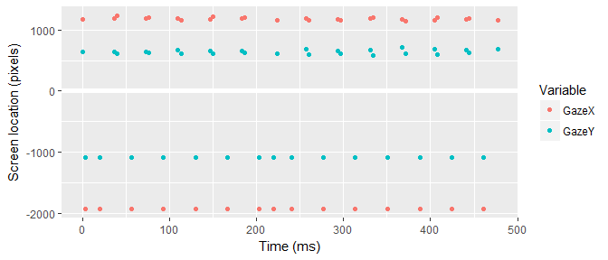
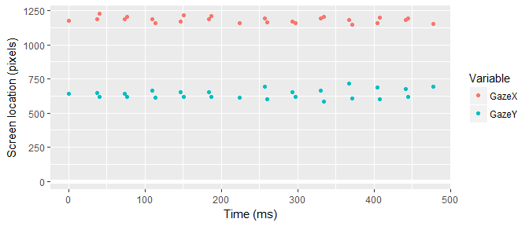

<!-- README.md is generated from README.Rmd. Please edit that file -->
fillgaze
========

The goal of fillgaze is to provide helper functions for interpolating missing eyetracking data.

Installation
------------

You can install fillgaze from github with:

``` r
# install.packages("devtools")
devtools::install_github("tjmahr/fillgaze")
```

Example
-------

This package was created in response to a very strange file of eyetracking data.

``` r
df <- readr::read_csv("inst/test-gaze.csv")
```

Here is the problem with this file:

``` r
library(dplyr, warn.conflicts = FALSE)
library(ggplot2)

ggplot(head(df, 40)) + 
  aes(x = Time - min(Time)) + 
  geom_hline(yintercept = 0, size = 2, color = "white") + 
  geom_point(aes(y = GazeX, color = "GazeX")) +
  geom_point(aes(y = GazeY, color = "GazeY")) + 
  labs(x = "Time (ms)", y = "Screen location (pixels)", 
       color = "Variable")
```



Every second or third point is incorrectly placed offscreen, indicated by a negative pixel values for the gaze locations. It is physiologically impossible for a person's gaze to oscillate so quickly and with such magnitude (the gaze is tracked on a large screen display).

I would like to interpolate spans of missing data using neighboring points. That's the point of this package. The steps to solve the problem involve:

-   \[x\] Converting offscreen values into proper `NA` values.
-   \[x\] Identifying gaps of missing values (streaks of successive `NA`s).
-   \[ \] Interpolating the values in a gap.

### Setting values in several columns to NA

We need to mark offscreen points as properly missing data. `set_values_to_na()` takes a dataframe and named filtering predicates. Here's the basic usage.

``` r
set_values_to_na(dataframe, {col_name} = {function to determine NA values})
```

The values that return `TRUE` for each function are replaced with `NA` values. For example, `set_values_to_na(df, var1 = ~ .x < 0)` would:

-   look for the column `var1` in the dataframe,
-   check which values of `.x < 0` are true where `.x` is a placeholder/pronoun for the values in `df$var1`,
-   replace those values where the test is `TRUE` with `NA`.

``` r
library(fillgaze)
before <- head(df$GazeX)

df <- df %>% 
  set_values_to_na(
    GazeX = ~ .x < -100, 
    GazeY = ~ .x < -100, 
    LEyeCoordX = ~ .x < -.1, 
    LEyeCoordY = ~ .x < -.1,
    REyeCoordX = ~ .x < -.1, 
    REyeCoordY = ~ .x < -.1)

# Before and after on some of the GazeX values
data_frame(before, after = head(df$GazeX))
#> # A tibble: 6 x 2
#>      before    after
#>       <dbl>    <dbl>
#> 1  1176.452 1176.452
#> 2 -1920.000       NA
#> 3 -1920.000       NA
#> 4  1184.452 1184.452
#> 5  1224.841 1224.841
#> 6 -1920.000       NA
```

Now, those offscreen points will not be plotted because they are `NA`.

``` r
last_plot() %+% head(df, 40)
#> Warning: Removed 15 rows containing missing values (geom_point).

#> Warning: Removed 15 rows containing missing values (geom_point).
```



### Finding gaps in the data

We can use `find_gaps()` to find the gaps in a column of data. `start` and `end` are the nearest non-`NA` values. Those values are in `start_value` and `end_value`. The number of `NA` values is in `na_size`.

``` r
find_gaps(df, GazeX)
#> # A tibble: 579 x 7
#>     .var start   end na_size start_value end_value  change
#>    <chr> <dbl> <dbl>   <dbl>       <dbl>     <dbl>   <dbl>
#>  1 GazeX     1     4       2    1176.452  1184.452   8.000
#>  2 GazeX     5     7       1    1224.841  1187.916 -36.925
#>  3 GazeX     8    10       1    1203.642  1188.502 -15.140
#>  4 GazeX    11    13       1    1158.650  1171.602  12.952
#>  5 GazeX    14    16       1    1218.452  1188.027 -30.425
#>  6 GazeX    17    20       2    1208.003  1156.564 -51.439
#>  7 GazeX    20    22       1    1156.564  1191.023  34.459
#>  8 GazeX    23    25       1    1164.210  1171.983   7.773
#>  9 GazeX    26    28       1    1158.890  1194.300  35.410
#> 10 GazeX    29    31       1    1207.380  1179.723 -27.657
#> # ... with 569 more rows
```

The function also respects dplyr grouping, so that e.g, false gaps are not found between trials.

``` r
df %>% 
  group_by(Trial) %>% 
  find_gaps(GazeX)
#> # A tibble: 561 x 8
#>    Trial  .var start   end na_size start_value end_value  change
#>    <int> <chr> <dbl> <dbl>   <dbl>       <dbl>     <dbl>   <dbl>
#>  1     1 GazeX     1     4       2    1176.452  1184.452   8.000
#>  2     1 GazeX     5     7       1    1224.841  1187.916 -36.925
#>  3     1 GazeX     8    10       1    1203.642  1188.502 -15.140
#>  4     1 GazeX    11    13       1    1158.650  1171.602  12.952
#>  5     1 GazeX    14    16       1    1218.452  1188.027 -30.425
#>  6     1 GazeX    17    20       2    1208.003  1156.564 -51.439
#>  7     1 GazeX    20    22       1    1156.564  1191.023  34.459
#>  8     1 GazeX    23    25       1    1164.210  1171.983   7.773
#>  9     1 GazeX    26    28       1    1158.890  1194.300  35.410
#> 10     1 GazeX    29    31       1    1207.380  1179.723 -27.657
#> # ... with 551 more rows

# todo: unit tests
```

This function is used internally. Users are not expectedly to routinely use this function, but I cover it here because the next function for filling gaps uses the indices and values in this dataframe.

``` r
dots <- quos(GazeX, GazeY)
max_gap <- 5
max_sd <- 2
func <- median
data <- df

df <- fill_gaze(df, GazeX, GazeY, func = median, max_gap = 5, max_sd = 2)

last_plot() %+% head(df, 40)
```


